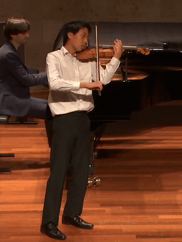
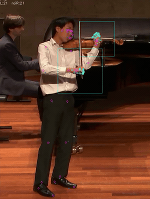
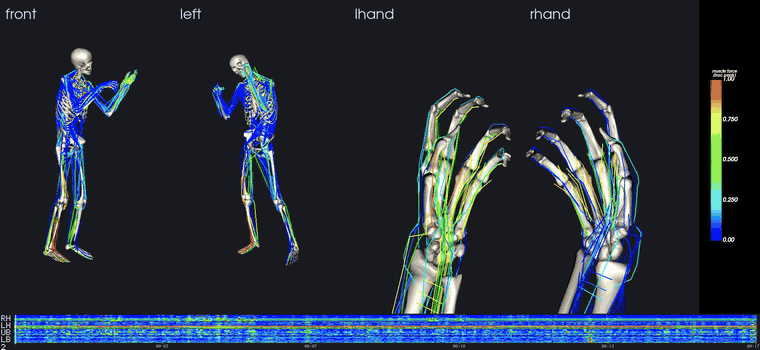

# KinemaStudio

**Markerless biomechanics from a single video.** KinemaStudio turns an
ordinary RGB clip into a driven OpenSim musculoskeletal simulation — pose
and hand tracking with Google MediaPipe, fused into an OpenSim-ready
marker trajectory, then solved up the dynamics stack: joint kinematics,
joint moments, kinematics-estimated ground reaction forces, and
individual **muscle forces** (Static Optimization), rendered as a
muscle-force video. No motion-capture suit, no markers, no force plates —
the ground reactions are recovered from the motion itself.

The walkthrough below is the bundled `demo/Wieniawski2` clip
(solo violin performance, ~17 s, 500 frames @ 30 fps) carried through
every stage.

## The pipeline

### 1 · Input video

A plain handheld recording — the only input the pipeline needs.



### 2 · MediaPipe tracking  (`mp2trc.py`)

Each frame is run through MediaPipe: a full-body pose plus a detailed
21-landmark HandLandmarker on an ROI cropped around each wrist. The
landmarks (overlaid below) are unified into one world frame, low-pass
filtered, and written as an OpenSim `.trc` marker file with a generated
IK setup. One command does Stage 1 (video → landmark CSVs + annotated
video) and Stage 2 (CSVs → `.trc`).

By default the wrapper also runs a **combine** step (`combine_hands.py`):
the ROI hand detector and MediaPipe's Holistic hands miss *different*
frames, so for each frame the ROI detector dropped but Holistic found,
the Holistic hand is mapped into the ROI frame (the same pose-wrist
transform the ROI stream uses) and blended in — recovering real hand
data instead of blindly interpolating across the gap.



### 3 · Kinematics, dynamics & muscle forces  (`run_ik.py` → `run_grf.py` → `run_id.py` → `run_so.py`)

`run_ik.py` solves robust per-frame Inverse Kinematics of the
`combined_body_model` against the marker trajectory (a non-converging
frame holds the last good pose instead of aborting the whole solve).
Optionally `scale_model.py` first fits the model's segment lengths to the
subject from the markers, and `run_grf.py` estimates **ground reaction
forces straight from the kinematics** (no force plates): the whole-body
net wrench is fully determined by the motion + inertia, so it is computed
from the posed frames and attributed to the feet as an OpenSim
`ExternalLoads`.

`run_id.py` then runs Inverse Dynamics for the net joint moments that
produced the motion; with the estimated GRF applied it is dynamically
consistent — the free-base residual collapses to ≈0 instead of absorbing
the whole unbalanced load. Finally `run_so.py` runs **Static
Optimization**, resolving those joint moments into the individual
**muscle forces** that produced them (minimising summed activation² per
frame, subject to each muscle's force capacity) — the per-muscle forces
the render colours by. Scaling, GRF, and SO are each opt-in
(`--scale` / `--grf` / `--so`); see [Quick start](#quick-start).

### 4 · Musculoskeletal render  (`viz_osim.py`)

Headless VTK renders the posed skeleton and every muscle path, tiled by
default **front / left / lhand / rhand** — two whole-body views plus a
hand-focused close-up of each hand. Muscles are colored by true SO
muscle force when a `.so_force.sto` is present, else by the inverse-
dynamics joint moment (blue → red). The `lhand`/`rhand` panels track the
wrist and, by default (`--hand-orient`, disable with `--no-hand-orient`),
lock the hand palm-to-viewer to isolate finger articulation. Override
the panels with `--views` (front/back/left/right/iso/top/bottom,
explicit `AZ[:EL]`, or `rhand`/`lhand`).
The timeline strip is on by default: a thin bottom band with a whole-
clip joint-moment heatmap (right-hand / left-hand / upper body / lower
body, same blue → red scale), an MM:SS axis, and a moving current-frame
indicator + frame number. Its joint moments are loaded from the ID
`.sto` independently of the muscle colouring, so it shows even when
muscles are coloured by SO force. Disable it with `--no-timeline`.



## Quick start

Environment setup (one Python 3.12 venv runs everything — OpenSim,
MediaPipe, VTK) is in **[docs/SETUP.md](docs/SETUP.md)**:

```bash
python3.12 -m venv .venv
.venv/bin/python -m pip install -U pip wheel
.venv/bin/pip install -r requirements.txt
```

Run the **whole pipeline** on the bundled clip with the top-level
wrapper (default hand source: **combined** — heavy-pose ROI hands plus
Holistic-recovered rows for frames the ROI detector missed):

```bash
.venv/bin/python run_pipeline.py demo/Wieniawski2.mp4
```

Outputs land in `runs/Wieniawski2/`. Options after `--` pass straight
to Stage 1, e.g. the ROI-only baseline or the faster Holistic-only path:

```bash
# ROI-only baseline (no Holistic recovery):
.venv/bin/python run_pipeline.py demo/Wieniawski2.mp4 -- --hand-source roi
# faster Holistic-only path:
.venv/bin/python run_pipeline.py my_clip.mp4 --no-viz -- \
    --pose-model holistic --no-roi-hands --hand-source registered
```

Add `--scale` to fit the model to the subject before IK: the wrapper
inserts a measurement-based scaling stage (`src/scale_model.py`) after
Stage 1, scaling segment lengths from the just-produced TRC, and the
scaled `.osim` is then used by IK/ID/viz. Its knobs (averaging window,
mass, humerus) come from the `scale_model:` block of the YAML.

```bash
.venv/bin/python run_pipeline.py demo/Wieniawski2.mp4 --scale
```

Add `--so` to run **Static Optimization** after Inverse Dynamics: the
wrapper inserts `src/run_so.py`, which resolves the ID joint moments
into per-muscle forces, writing `<root>.so_force.sto` (forces, N) and
`<root>.so_activation.sto` (activations, 0–1). It is slow (a QP per
frame over the whole clip) and only approximate on markerless data —
there are no measured ground/contact forces and the model base is a
free joint, so per-coordinate reserve actuators absorb the residuals
(tune with the `run_so:` block). `viz_osim` auto-detects the
`.so_force.sto` and colours muscles by true force when present (falling
back to the ID joint-moment projection otherwise).

Because SO solves a per-frame optimisation, it is the slow stage. Frames
are independent, so `src/run_so.py --jobs N` solves the clip in `N`
parallel processes (near-linear speed-up; identical result bar tiny
warm-start differences at the chunk seams), and `--stride N` solves
every Nth frame for a fast preview. Set them in the `run_so:` config
block to use them through the wrapper. Supplying `--grf` (below) also
makes SO far faster by removing the base residual it would otherwise
fight on every frame.

```bash
.venv/bin/python run_pipeline.py demo/Wieniawski2.mp4 --scale --so
```

Add `--grf` to estimate **ground reaction forces from the kinematics
alone** (no force plates), the fix for that floating-base problem. The
wrapper inserts `src/run_grf.py` after IK: the whole-body Newton–Euler
net external wrench is fully determined by the motion + inertia, so it
is computed from the posed frames and attributed to the feet (contact
detected from the heel/foot-index markers vs an estimated floor; single
support → the whole wrench at the true COP, double support → split by
where the net COP falls between the feet). It writes `<root>.grf.sto`
and an `<root>.externalloads.xml` that ID and SO then apply, so the
base residual collapses to ≈0 (on the demo clip the vertical residual
drops from a full bodyweight, ~742 N, to ~10 N) and both become
dynamically consistent **for any motion, including lower-body / gait**.
This also makes SO converge quickly (without it SO fights phantom base
residuals on nearly every frame). Use the same `lowpass` across
`run_grf`/`run_id`/`run_so` for the tightest residuals.

```bash
.venv/bin/python run_pipeline.py demo/Wieniawski2.mp4 --scale --grf --so
```

The per-foot load during double support is the documented
approximation (the net wrench is always exact); see `src/run_grf.py`
and Ren et al. 2008 for the method.

Settings you reuse can live in an optional `kinemastudio.yaml`
(`src/pipeline_config.py`) — `outdir`/`model`/`no_id`/`no_viz`/`scale`/
`so`/`grf`/`combine` plus a per-stage block of extra flags for `mp2trc`/
`scale_model`/`run_ik`/`run_grf`/`run_id`/`run_so`/`viz_osim`/
`combine_viz`. The **wrapper and every stage script read the same file**,
so re-running one stage standalone (e.g. just `run_ik.py` after a
weight tweak) honours the same config a full run would. Precedence is
built-in defaults < YAML < explicit command-line flags (and anything
after `--`), so the file holds your typical values and a one-off flag
still wins. It auto-loads from `./kinemastudio.yaml` or the repo root;
use `--config PATH` to point elsewhere, `--no-config` to ignore it, and
`--dump-config [PATH]` to write a commented template:

```bash
.venv/bin/python run_pipeline.py --dump-config kinemastudio.yaml
.venv/bin/python run_pipeline.py demo/Wieniawski2.mp4   # picks it up
.venv/bin/python src/run_ik.py runs/Wieniawski2/Wieniawski2.combhands.trc  # too
.venv/bin/python run_pipeline.py demo/Wieniawski2.mp4 --config tuned.yaml
```

The bundled `kinemastudio.yaml` only pins the head–neck model (see
[The model](#the-model)); it sets no per-marker IK weight overrides.
With the neck joint in place, a weight sweep (vs the source video's
head-vs-trunk angle) shows uniform default 0.6 weights are optimal —
the earlier head de-weighting and shoulder downgrade were
compensating for the missing neck joint, now fixed at the model
level.

`run_pipeline.py --debug` echoes each stage's exact, copy-pasteable
invocation (the args the wrapper passes it) just before running it —
useful for reproducing or driving a single stage by hand.

Or drive each stage yourself:

```bash
.venv/bin/python src/mp2trc.py   my_clip.mp4 --outdir runs
.venv/bin/python src/run_ik.py   runs/my_clip/my_clip.roihands.trc
.venv/bin/python src/run_grf.py  runs/my_clip/my_clip.roihands.ik.mot  # optional GRF -> ExternalLoads
.venv/bin/python src/run_id.py   runs/my_clip/my_clip.roihands.ik.mot  # add --external-loads <...>.externalloads.xml
.venv/bin/python src/run_so.py   runs/my_clip/my_clip.roihands.ik.mot  # optional muscle forces (+ --external-loads)
.venv/bin/python src/viz_osim.py models/combined_body_model/combined_body_model.osim \
                                 runs/my_clip/my_clip.roihands.ik.mot
.venv/bin/python src/combine_viz.py runs/my_clip/my_clip.roihands.viz.mp4
```

`combine_viz.py` ffmpeg-stacks the `_merged` annotated source video
above the viz render (default `--layout vstack`; use `--layout hstack`
for side-by-side) and muxes in the original audio. **The wrapper runs
it automatically** after the render (→ `<stem>.combo.mp4`); disable with
`--no-combine`.

Every script (and the wrapper) takes `--help`. `scale_model.py`
optionally scales the model to the subject before IK for more
anatomically faithful joint angles — run it standalone, or let the
wrapper drive it with `--scale` (above).

## Repository layout

```
run_pipeline.py               one-command wrapper for the pipeline stages
src/                          pipeline scripts
  mpipe_pipeline.py           Stage 1/2 engine (imported by mp2trc)
  mp2trc.py                   video -> .trc + IK setup
  combine_hands.py            recover ROI-missing hand frames from Holistic
  scale_model.py              optional subject scaling
  run_ik.py  run_id.py        OpenSim inverse kinematics / dynamics
  run_grf.py                  optional GRF estimation -> ExternalLoads
  run_so.py                   optional Static Optimization (muscle forces)
  viz_osim.py                 musculoskeletal playback render
  combine_viz.py              ffmpeg-stack the viz + _merged source + audio
models/
  combined_body_model/        the .osim model + Geometry/ meshes
  mediapipe/                  MediaPipe .task bundles (auto-downloaded)
templates/TEMPLATE_IK.xml     IK setup skeleton
docs/SETUP.md                 environment reproduction guide
demo/Wieniawski2.mp4          bundled example clip (run output is regenerable)
requirements*.txt             pinned dependencies
```

## The model

`combined_body_model.neck.osim` is the default — a full-body OpenSim
model with detailed articulated hands, posed from MediaPipe markers
(75.59 kg default subject). It is derived from `combined_body_model.osim`
by `scratchpad/build_neck_model.py`, which adds a lumped head–neck
joint: a 4.3 kg `head` body (skull/jaw + cervical-spine geometry) on a 3-DoF `neck`
joint (`neck_flexion`/`neck_bending`/`neck_rotation`), with the 13
MediaPipe head/face markers re-parented onto it. Without this joint the
head markers are rigid on the torso, so the subject looking down (e.g.
at an instrument) is forced into trunk flexion — the model renders
badly hunched. The neck joint lets that head pitch live in
`neck_flexion` instead; on `practice_41d` it cut trunk forward-tilt
~15° with marker RMS essentially unchanged (0.040→0.043 m). Geometry
resolves from `models/combined_body_model/Geometry/`. Pass `--model`
(or set `model:` in `kinemastudio.yaml`) to use a different `.osim`;
the original headless model remains as `combined_body_model.osim`.

## Notes

- Defaults are tuned for the accurate path: separate **heavy**
  PoseLandmarker, ROI-cropped hands, debug ROI boxes on the annotated
  video, and — via `run_pipeline.py` — the **combined** hand source
  (ROI plus Holistic-recovered frames; `combine_hands.py`). On the
  bundled clip combine recovers ~10% of frames per hand that the ROI
  detector dropped, with overall IK marker RMS unchanged
  (0.0374→0.0376 m) — i.e. no solve cost, real hand data instead of
  interpolation. Override after `--`: `-- --hand-source roi` for the
  ROI-only baseline, or `--pose-model holistic --no-roi-hands
  --hand-source registered` for the faster Holistic-only path.
- Markerless capture has no measured muscle activity, force plates, or
  external loads. `run_grf.py` recovers the ground reactions from the
  kinematics and `run_so.py` resolves muscle forces by Static
  Optimization, but both are **estimates**: SO leans on per-coordinate
  reserve actuators where the model is under-actuated (a large reserve
  flags low confidence there), and the double-support GRF split is
  approximate even though the net wrench is exact. Treat the muscle
  forces as relative, not validated absolutes.
- MediaPipe's shoulder is its noisiest landmark (a surface point, not the
  glenohumeral center); `scale_model.py` excludes the humerus from
  scaling for this reason.
